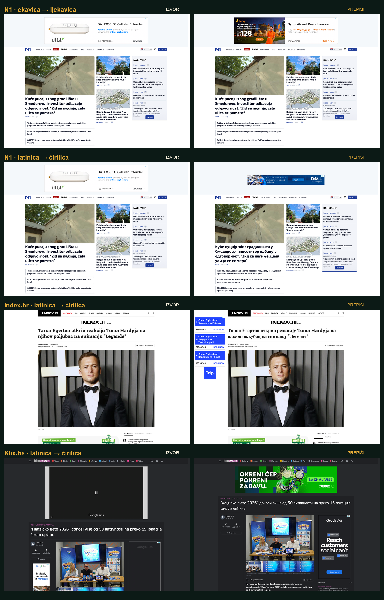

# Prepiši

<p align="center">
  
</p>

Prepiši is a privacy-first browser extension for reading Serbian, Croatian,
Bosnian, and Montenegrin web text in a preferred script and pronunciation.
The Chromium Manifest V3 build is working today. Firefox and Safari builds are
generated from the same offline engine so browser support can grow without
forking the conversion rules or vocabulary.

## What works

- Latin → Cyrillic and Cyrillic → Latin conversion, including `lj`, `nj`, and `dž`
  capitalization, Montenegrin `ś / ź`, and common false-digraph cases such as
  `injekcija`.
- Bidirectional Ekavian ↔ Ijekavian conversion from reviewed families, aligned
  corpus observations, and compact srLex/hrLex-derived inflections, with
  reviewed three-way Ikavian coverage where available.
- Combined conversion in one action, for example Ijekavian Cyrillic → Ekavian Latin.
- One-click controls: choosing a script, pronunciation, or highlight setting applies
  immediately to the active page.
- Page-specific controls: reopening the popup reads the active tab's real state;
  a different tab starts at the source settings by default.
- Per-site continuity: **Remember on this site** reapplies the selected modes
  after navigation. Reviewed news portals share rules across a finite list of
  explicit editorial aliases such as the apex and `www` host; unknown sites
  remain exact-host. Firefox predeclares the reviewed portal catalog for its
  event page. Signed-build validation is still pending.
- A one-click Latin/Cyrillic interface switch, stored locally and independent of
  the script selected for the web page.
- Optional dialect-only highlighting through browser-native text ranges; page HTML
  is not wrapped or rewritten to produce the highlight.
- Reversible page changes: every conversion is recalculated from the original text.
- Dynamic-page support through a scoped DOM observer.
- Preservation of code, form fields, editable areas, URLs, email addresses, handles,
  explicitly foreign-language spans, built-in brands, and custom protected names.
- Official-capitalization protection for 711 unique company names from the 2026
  Fortune 500, FTSE 100, CAC 40, DAX 40, and IBEX 35 snapshots.
- No server, telemetry, analytics, account, or network request.
- Minimal platform-appropriate permissions: Chrome, Edge, and Safari touch only
  the active page until an exact host or finite reviewed portal family is
  remembered. Firefox additionally predeclares that editorial-portal batch,
  surfaced by Firefox through its install, settings, or first-use permission UI.

## Load it in a Chromium browser

1. Open `chrome://extensions` (or `edge://extensions`).
2. Enable **Developer mode**.
3. Choose **Load unpacked** and select this repository folder, or run
   `npm run build:chromium` and select `build/chromium`.
4. Open a normal web page, click **Prepiši**, and choose a script or pronunciation.
   Each choice is applied immediately.

For target-specific Chrome, Edge, and Firefox development folders—including the
exact Firefox temporary-add-on steps—see [`docs/LOCAL_INSTALL.md`](docs/LOCAL_INSTALL.md).

The extension cannot run on browser system pages, extension stores, or other pages
where browsers forbid extensions. Temporary access normally ends when the user
leaves the page. A user may opt into a hostname, or a finite set of reviewed
editorial aliases, so links keep the selected conversion. Prepiši never uses a
registrable-domain wildcard and never requests required access to every site.
See the [curated portal catalog and research](research/CURATED_EDITORIAL_PORTALS.md).

Firefox Android manual conversion has passed, but automatic remembered
navigation has not yet passed in an unsigned temporary installation. Firefox's
settings page includes an opt-in, single-host local diagnostic log for the next
device pass. The log is limited to technical stages and stores neither page text
nor full URLs. See the [dated Android test](docs/FIREFOX_ANDROID_TEST.md) and
[MV3 event-page research](research/FIREFOX_MV3_ANDROID_EVENT_PAGES.md).

## Run the checks

With Node.js installed:

```text
npm test
npm run check
npm run discover:jat
npm run discover:ikavian
npm run audit:countries
npm run audit:territories
npm run build:data
npm run build:all
npm run package
```

`npm run build:all` creates ignored, unpacked targets under `build/`. `npm run
package` creates clean Chromium and Firefox ZIPs plus a Safari source ZIP under
`dist/`; tests, research caches, private fonts, and project metadata are excluded.

## Contributing and linguistic data

The public-facing project structure keeps reviewed rules, generated data, and
research candidates visibly separate:

- [`CONTRIBUTING.md`](CONTRIBUTING.md) explains local setup, pull requests, and
  the safe review workflow for `jat-candidates.csv`;
- [`docs/DIALECT_DATA.md`](docs/DIALECT_DATA.md) explains exactly what each
  pronunciation choice means, evidence levels, source files, and how to add or
  reject a relation;
- [`research/COUNTRY_DEMONYM_AUDIT.md`](research/COUNTRY_DEMONYM_AUDIT.md)
  records the separate full-lexicon check for jat-sensitive country and citizen
  names, including known corpus gaps;
- [`research/BROWSER_COMPATIBILITY.md`](research/BROWSER_COMPATIBILITY.md) records
  browser support decisions and official vendor sources;
- [`docs/PROJECT_STATUS.md`](docs/PROJECT_STATUS.md) is the concise machine-handoff
  note with the verified baseline and next release work;
- [`docs/PERSONAL_PUBLISHER_ACCOUNTS.md`](docs/PERSONAL_PUBLISHER_ACCOUNTS.md)
  records the personal-account setup, store-registration choices, and submission
  order for Chrome, Edge, Firefox, and Safari;
- [`docs/LAUNCH_AND_SOCIAL.md`](docs/LAUNCH_AND_SOCIAL.md) is the 0.9.1 review
  wait list, check-back dates, and social-post drafts;
- [`AGENTS.md`](AGENTS.md) gives coding agents the repository guardrails and the
  current Firefox Android/macOS handoff;
- [`SECURITY.md`](SECURITY.md), [`PRIVACY.md`](PRIVACY.md), and
  [`ATTRIBUTIONS.md`](ATTRIBUTIONS.md) make the local-only boundary and source
  responsibilities explicit.

Bad-conversion and dialect-data issue forms are included under `.github/`, and
the continuous-integration workflow runs the complete offline test suite on every
push and pull request.

For a controlled installed-extension test, serve `test/fixture.html` from a
local HTTP server, load the extension, and exercise the matrix below through the
extension popup—not the fixture's green development buttons. The separate
`npm run test:browser-dom` command drives that built-in harness in headless
Chrome; because the fixture imports repository source directly, that command
does not validate extension installation, popup controls, the manifest, or
browser permissions.

For the pre-publication real-site pass, follow [`HUMAN_TEST.md`](HUMAN_TEST.md).

| Source | Target script | Target pronunciation | Expected sample |
|---|---|---|---|
| `mleko` | Latin | Ijekavian | `mlijeko` |
| `млијеко` | Latin | Ekavian | `mleko` |
| `Njegoš` | Cyrillic | Original | `Његош` |
| `ЉУБЉАНА` | Latin | Original | `LJUBLJANA` |
| `vrijeme` | Cyrillic | Ikavian | `ВРИМЕ` only when source is uppercase; otherwise `вриме` |

Also check restoration, dynamically added text, protected brands, custom protected
terms, English `lang` spans, and skipped `code` content.

## Linguistic scope

The standard high-level division by the reflex of historical *jat* is Ekavian,
(I)jekavian, and Ikavian. Short `je` and long `ije` are normally part of the same
Ijekavian system, not separate extension targets. Matica hrvatska describes the
three reflexes with examples such as `svet / svijet / svit`.

Script conversion is largely deterministic. Pronunciation conversion is not: word
history, inflection, meaning, and regional usage matter. The prototype therefore
starts with 52 auditable word families and 317 reviewed form rows in
`src/dialect-data.js` instead of a global `e → ije` rule that would corrupt
ordinary words. It then adds compact generated rows from pinned source data,
for 4,102 exact rows in version 0.9. There are now 233 three-way
Ekavian/Ijekavian/Ikavian rows, including 80 inflections derived from 15
Mići Princ-attested lemma families; the remainder deliberately support the safer
Ekavian/Ijekavian directions only. Ikavian is labeled beta because it has
multiple regional realizations and more collisions with unrelated standard
words. The vocabulary grows through reviewed families and real-page regression
cases such as `vetar ↔ vjetar`.

Foreign-name spelling is a separate layer. For example, `Richter ↔ Rihter` is
not a dialect change. Version 0.4 preserves a detected source-spelled foreign
name rather than producing broken character-by-character Cyrillic; a future
orthography option will require source-language transcription rules and a
reviewed name vocabulary.

Detection is deliberately conservative and cannot identify every personal name
from spelling alone. A name containing a strong foreign signal such as `y`, `w`,
`x`, `q`, `th`, or `ch` is preserved with adjacent capitalized name parts. A name
such as `Taron Egerton`, whose letters are all valid in ordinary BCMS Latin text,
currently falls through to script conversion, while `Toma Hardyja` is preserved
because of `y`. This is a known heuristic boundary, not a linguistic judgment
about either name. Protecting every capitalized phrase would also freeze many
local names that should be transliterated.

### `dj`, `đ`, and `dž`

`dj` is not a single letter in the shared Latin alphabet. The single letter is
`đ` (Cyrillic `ђ`), while `dž` is one of the three digraph letters together with
`lj` and `nj`. Therefore standard Ijekavian `ovdje` contains separate `d + j` and
transliterates as `овдје`, not `овђе`. The converter has a regression test for
`ovdje / đe / džem` so these three cases cannot collapse into one another.

Montenegrin adds a language-standard distinction rather than a jat-reflex rule:
its orthography lists both non-jotated `ovdje` and jotated `ovđe`, and similarly
`gdje / đe`, as doublets. Prepiši keeps `ovdje` for the general Ijekavian target;
a future Montenegrin-jotation preference should be a separate option, not hidden
inside the Ijekavian button.

The resource and library audit, including COMtext.SR, srLex/hrLex, CLASSLA,
Epitran, and existing transliteration packages, is in
[`research/DIALECT_RESEARCH.md`](research/DIALECT_RESEARCH.md).

### How the larger lexicons fit

The “millions” in srLex/hrLex are inflected, morphologically tagged rows, not
millions of dictionary headwords. srLex 1.3 contains 169,328 lemmas and
6,905,941 rows; hrLex 1.3 contains 164,206 lemmas and 6,427,709 rows. The
official gzip files are about 54.2 MiB and 52.0 MiB, while their tabular text
expands to about 1.19 GiB and 1.10 GiB because each form repeats eight fields.

Those full files are build-time inputs only. The current generated extension
files are roughly 35 KiB for corpus observations and 125 KiB for lexicon-expanded
forms. Runtime conversion remains self-contained: no server, model download, or
page-text upload occurs.

srLex/hrLex are not themselves a parallel dialect dictionary. Prepiši supplies
lemma relationships from independent reviewed files and secondary corpora, then
uses matching morphological tags to expand safe inflections. COMtext currently
contributes 316 lemma relationships observed in one legal corpus, but that number
is explicitly non-exhaustive and is neither a rule nor a cap. The source folder
is additive so a larger Leximirka export or author-supplied list can be included
without changing the converter.

### Frequent-word discovery

`npm run discover:jat` streams the pinned official archives and ranks the 10,000
most frequent hrLex lemma families. Repeated analyses of the same lemma and
surface form are deduplicated before their absolute frequencies are summed. The
scanner proposes `ije/je → e` matches in srLex, checks equal part of speech and
morphosyntactic slots, and keeps `i → e` and all mechanical Ikavian suggestions
in the review queue only.

Version 0.5 examined 10,000 of 99,544 eligible hrLex lemmas. It found 876
candidates: 195 are now known, 58 new relationships met the strict automatic
criteria and passed a complete release audit, and 623 remain review-only. The
review report is `research/generated/jat-candidates.csv`. A semantic blocklist
keeps lookalikes such as `preko / prijeko` out, and a pinned hash prevents a
changed automatic list from entering a later runtime build without a new audit.

`npm run discover:ikavian` intersects those mechanical Ikavian suggestions with
the locally cached Mići Princ text and regenerates
`research/generated/ikavian-attestations.csv`. The pinned scan found 37 exact
lemma attestations; version 0.6 selects 15 and records unsafe exclusions with
reasons in `data/ikavian-relations/mici-princ.json`.

#### Reviewing candidate rows

`research/generated/jat-candidates.csv` is a generated worklist. Fill only the
`decision`, `reviewer`, and optional `review_notes` columns; use `approve`, `reject`,
or `defer`. Do not edit `generated_status`.

Run `npm run apply:jat-reviews` before regenerating the report. It copies decisions
to the durable ledger at `data/jat-discovery/reviews.csv`, creates the reviewed
relation source, and updates the semantic blocklist. `npm run discover:jat` and
`npm run build:data` perform this import automatically before they overwrite the
generated report. The earlier `OK (Nemanja)` edit was migrated this way as the
approved `sudelovanje ↔ sudjelovanje` relation; its five safe inflection pairs now
ship in the runtime data.

Brand preservation is similarly explicit. Unknown names cannot always be
distinguished from ordinary sentence-initial words without a remote model, so the
extension combines a small built-in list, automatically protected structural text,
foreign-language markup, and a local user-maintained list.
The company snapshot adds 715 list positions (711 unique names) and protects them
case-sensitively, so `Orange` can remain a company while ordinary lowercase
`orange` is still convertible. The list is bundled and never refreshed while a
user browses.

Toolbar icons are original stacked `PRE` / `ПРЕ` lockups. The popup wordmark is
currently a Balkan Sans-derived raster; its distribution right is outstanding
until confirmed with Typotheque or replaced. Font binaries are not part of the
repository or extension archive.

## Sources used for the first rules

- [Unicode Latin digraphs matching Serbian Cyrillic letters](https://www.unicode.org/charts/nameslist/n_0180.html)
- [Unicode documentation of Montenegrin Cyrillic `с́ / з́`](https://www.unicode.org/L2/L2011/11369-cyrillic-vip-issues.pdf)
- [Unicode CLDR Latin–Cyrillic transforms](https://www.unicode.org/cldr/cldr-aux/charts/22/transforms/Latin-Cyrillic.html)
- [Matica hrvatska on Ekavian, (I)jekavian, and Ikavian jat reflexes](https://www.matica.hr/kolo/374/dokument-hazu-o-povijesti-i-ustroju-hrvatskoga-jezika-2007-21638/)
- [Chrome activeTab permission](https://developer.chrome.com/docs/extensions/develop/concepts/activeTab)
- [Chrome extension privacy guidance](https://developer.chrome.com/docs/extensions/develop/security-privacy/user-privacy)
- [CSS Custom Highlight API](https://developer.mozilla.org/en-US/docs/Web/API/CSS_Custom_Highlight_API)
- [MDN scripting API compatibility](https://developer.mozilla.org/en-US/docs/Mozilla/Add-ons/WebExtensions/API/scripting)
- [COMtext.SR parallel Ekavian/Ijekavian corpus](https://github.com/ICEF-NLP/COMtext.SR)
- [srLex and hrLex inflectional lexicons](https://reldi.rs/blog/serbian-lexicon/)
- [Mići Princ open Chakavian text and speech corpus](https://hdl.handle.net/11356/1765)
- [Croatian orthography: `dž`, `lj`, `nj`, and `đ`](https://pravopis.hr/slova/)
- [Montenegrin orthography: `ovdje / ovđe` doublets](https://ucg.ac.me/skladiste/blog_19952/objava_68038/fajlovi/pravopis_crnogorskoga_jezika.pdf)

## Browser targets

All browser packages use the same files in `src/`, including one small
`browser`/`chrome` namespace adapter. Browser-specific settings live under
`manifests/` and are merged only while generating `build/<target>`.

| Target | Repository state | Distribution path |
|---|---|---|
| Chrome desktop | Generated Chromium build; tested primary target | Chrome Web Store |
| Edge desktop, Android, and iOS | Generated Edge package; desktop and both mobile platforms still require smoke tests and Microsoft certification | Microsoft Edge Add-ons |
| Brave and Opera desktop | Chromium compatibility candidates; test before claiming support | Chrome Web Store / Opera Add-ons |
| Firefox desktop and Android | Generated MV3 build; device smoke tests and Mozilla signing still required | Mozilla Add-ons |
| Safari macOS, iOS, and iPadOS | Generated web-extension source; Apple wrapper and device QA still required | Xcode/App Store/TestFlight |
| Yandex Android | Exploratory Chromium-mobile target after a published Chrome build | Chrome/Opera catalog or developer loading |
| Orion iOS/iPadOS | Exploratory manual Safari-extension compatibility test, not a release target | User-installed compatible extension |
| Samsung Internet | Not a ZIP port; Samsung approval and an Android application wrapper are required | Samsung closed partner program/Galaxy Store |
| Chrome Android and Firefox iOS | Not supported by those browsers' public extension models | None |

The Edge target is a separately named package for Microsoft Partner Center but
shares the Chromium manifest and runtime. Microsoft's mobile collection now lists
extensions for both Android and iOS; availability still depends on Microsoft
certification and successful device tests. The Firefox target declares desktop
140 and Android 142 minimums, a stable add-on
ID, and no data collection. The Safari target declares 17.2 for consistent Custom
Highlight support. See the compatibility research for the official sources and
the remaining real-device test gates.

## License and integration

Prepiši is distributed under the **GNU General Public License v3.0 only**
(`GPL-3.0-only`). This gives everyone the freedom to use, study, modify, and
redistribute the extension while keeping distributed modified versions open.
Copyright © 2026 Prepiši contributors.

The generated language tables retain durable attribution to their source
datasets in [`ATTRIBUTIONS.md`](ATTRIBUTIONS.md). CC BY-SA 4.0 is officially
one-way compatible with GPLv3, which lets the project distribute compatible
adapted language data with the GPLv3 program while preserving the source
credits. Unicode data retains its required Unicode notice.

If an organization has a serious integration need that cannot use GPLv3—for
example, incorporation into a proprietary product—contact the maintainers.
Relicensing would require us to obtain suitable permission from the relevant
data authors or replace those derived tables. In particular, explicit COMtext.SR
redistribution terms remain a public-release gate even though the project owners
describe the resources as intended for unrestricted, including commercial, use.
The privately licensed Balkan Sans font binaries are never part of this repository.

## Release gaps

- Obtain a larger reviewed lemma-relation source (ideally Leximirka or an
  author-supplied equivalent) and keep improving the conservative morphology
  matcher.
- Continue reviewing the remaining ranked Ikavian candidates. Version 0.6 ships
  only the 15 safe lemma families attested in Mići Princ; mechanical suggestions
  and collision-prone forms remain excluded.
- Confirm COMtext redistribution terms with its authors before public release.
- Add foreign-name orthography only as a separate, explicit user choice.
- Keep optional Windows ML/Core ML name recognition as a research-only native
  companion possibility; see `research/ON_DEVICE_NAME_RECOGNITION.md`.
- Human-test the optional exact-host/finite-alias persistence prompt and navigation flow
  in every release browser.
- Test shadow DOM, frames, very large pages, and accessibility with human testers.
- Test the exact store-signed Firefox package on desktop and Android and the
  exact TestFlight/App Store Safari builds before describing those packages as
  fully supported releases. The 0.9.1 local macOS/iPhone publishing smoke pass
  is recorded in `docs/APPLE_PLATFORM_TEST_2026-08-13.md`.
- Produce the required store icon sizes, screenshots, localized descriptions, and
  publish the privacy policy at a stable public URL.
